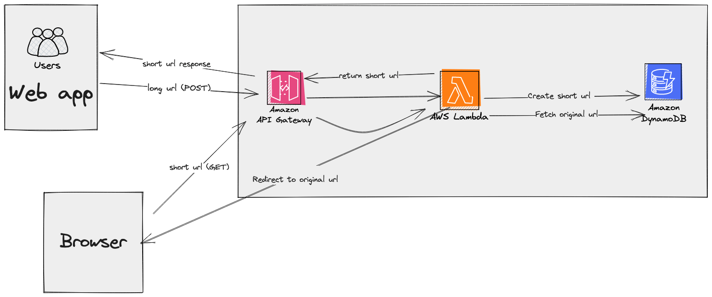

# URL Shortener

This is a url shortner service that takes in a valid long URL and returns a shortned URL in the form of `https://xhit.ca/xxxxxxx`.

Deployed App:

[https://www.xhiturl.ca/](https://www.xhiturl.ca/)

## API Reference

- [AWS CDK](https://docs.aws.amazon.com/cdk/api/v2/docs/aws-construct-library.html)
- [AWS SDK](https://docs.aws.amazon.com/AWSJavaScriptSDK/v3/latest/preview/)

## Setting Up

Please ensure you have AWS credentials configured in your machine and that your user has the required permissions to create AWS resources. If not, follow this **[link](https://docs.aws.amazon.com/cli/latest/userguide/cli-configure-files.html)** to configure your AWS credentials.

### Prerequisites

You need to have the following installed and configured:

- AWS CLI, with credentials configured.
- Node.js ( ≥ v16.x.x recommended). [Node.js](https://nodejs.org/)
- AWS CDK (v4)
- AWS SDK
- React.js (v18.x.x)

### Installation

1. Install AWS CLI globally. AWS CLI can be installed following the instructions **[here](https://docs.aws.amazon.com/cli/latest/userguide/cli-configure-quickstart.html)**

2. Install the backend dependencies:

   `yarn install`

3. Install the client dependencies
   `cd client && yarn install`

4. Before deploying, remember to define all the environment variables used in the project. These are injected during deployment or in local development stored in a **`.env`** file at the root of the project, and are loaded into **`process.env`** in Node.js using **`dotenv`**.

5. Deploy the project:

   This script will take care of creating all the necessary AWS resources (such as the Lambda functions, API Gateway, DynamoDB table, etc.) and deploying your code. The URL of your deployed application will be printed in the console upon successful deployment.

   `yarn deploy`

6. In case you want to destroy the infrastructure, you can run (at the root of the project):

   `cdk destroy`

## Infra

## In Progress

Set up DynamoDB in docker for local development

## Contact

If you have any questions or issues, please contact [email](larryagbana@gmail.com)

## License

This project is licensed under the MIT License - see the [LICENSE.md](LICENSE.md) file for details.
